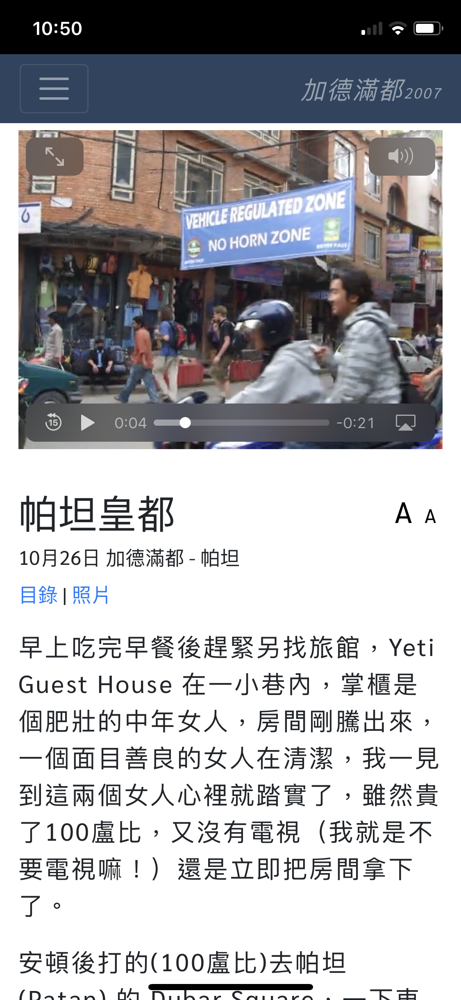

## [littleboat5.com](https://littleboat5.com)
Littleboat5.com is Cynthia Wong's personal travel blog that uses React as the frontend framework. All text-based data are stored in JSON files. 

This repository contains all the Javascript (ES6), HTML (HTML5), and SCSS files that build the app. Data and images are not included. 

Following are samples of what the app looks like on iphoneX:

&nbsp;&nbsp;&nbsp;&nbsp;&nbsp;
    
&nbsp;&nbsp;&nbsp;&nbsp;&nbsp;
